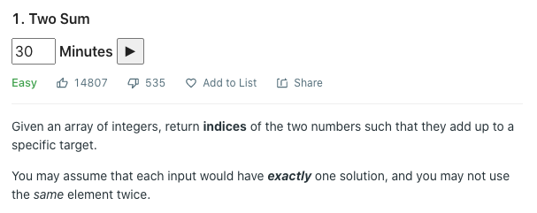

# LeetCode-Timer
Mount a Timer for LeetCode Problem Page

## Depends on
Please make sure [tampermonkey](http://tampermonkey.net/) or [greasemonkey](http://www.greasespot.net/) is installed

## Install
[Install LeetCode Timer](https://github.com/YukiDayDreamer/LeetCode-Timer/raw/master/LeetCode-Timer.user.js)

## Screenshots

### Settings

### Ongoing
